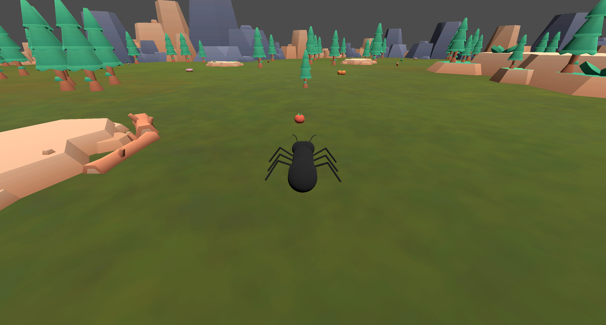
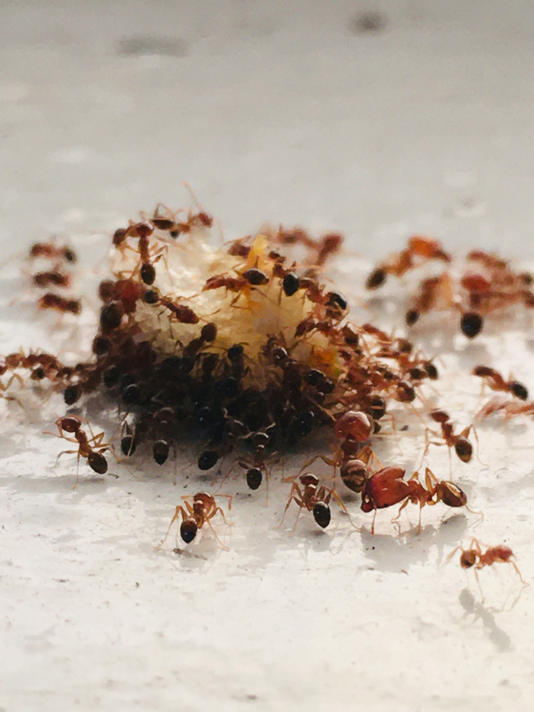
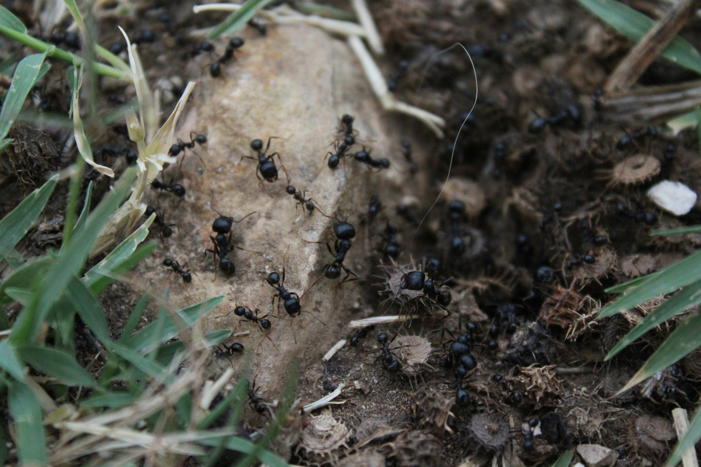

# Antz-GE-2-Project
This is an ant simulation that allows you to see the behaviour of an ant as it wanders around a world, avoiding obstacles and gathering food. User UI interaction for adjustment of ant behaviour.

## Inspiration
This project is inspired by ants in nature, their erratic movements and behaviours. Their complex behaviours are quite interesting from foraging to gathering, I wanted to make this possible in a simple simulation.

## Inspiration Sources
- Ants Wandering and Gathering when a food source is found: [What Really Happens When Ants Find Food?](https://www.youtube.com/watch?v=Dgtepw39NX4)
- Ants working together to solve a puzzle: [Ants vs Humans - T Shape Problem Solving Test](https://www.youtube.com/watch?v=j9xnhmFA7Ao)

Images of Ant Behaviours:
> *Source: Ant image by [Tanya Latty] via [https://theconversation.com/ants-in-your-house-heres-how-they-get-everywhere-even-high-up-in-tall-buildings-250625]*

> *Photo by [Marco Neri] on Unsplash [https://unsplash.com/photos/brown-and-black-ant-on-white-surface-EeYVX0VHn9g]*

> *Photo by [Spot the Top] on Unsplash [https://unsplash.com/photos/ants-on-the-ground-2rubP2L6jIA]*

## Implementation
The Antz simulation focuses on a Single custom designed Ant asset, the simulation includes:
- a world for the ant to roam around
- food to pickup
- obstacles to avoid
- UI controls for the user
- ant bahaviours

### World Design
The design of the world is made to allow the ant to roam freely without being able to clip/escape from the environment.
The design utilizes openly available assets, some of whcih include rocks, trees and a ground texture.
- Rock and tree assets are obtained from *Kenney*, [Kenney Survival Kit](https://www.kenney.nl/assets/survival-kit)
- Food assets are also obtained from *Kenney*, [Kenney Food Kit](https://www.kenney.nl/assets/food-kit)
- Ground Texture obtained from *OpenGameArt*, [Blended textures of dirt and grass](https://opengameart.org/content/blended-textures-of-dirt-and-grass)

### Food Pickup
Food objects are scattered around the world for the ant to pickup, these pickups happen automatically based on the ants behaviour and a pickup counter is increased on the UI

### Obstacles to Avoid
The worlds objects can be collided with, the ants behaviour allows it to navigate away from obstacles when it detects one

### UI Controls
I have created a UI for the user made up of a few sliders and checkboxes which allow for ant behaviour control. These can be used to test and play around with how the ant behaves

### Ant Behaviours
I have implemented a State Machine for the ants behaviours, these include Seek, Wander, Avoidance and GetFood. Each having their own necessary functionality. States are changed when different events occur

## Comparison - Real VS Simulated
My observations of the real world have shown that ants always appear to wander the environment erratically with seemingly no end goal. This is something that I have adjusted in the Ants behaviour, making the ant move in random directions and not in a straight line always.

In the real world, ants are almost always grouped up and not individually spread out, this is something that would be difficult to create in a simulation with the given time frame.

Future work for this project could include:
- A Colony of ants with different purposes
- Ant Cooperation and attacks on other ants
- Ant Pheromone trails when food is too big
- Simulation of a lifetime of ants, day-to-day simulation